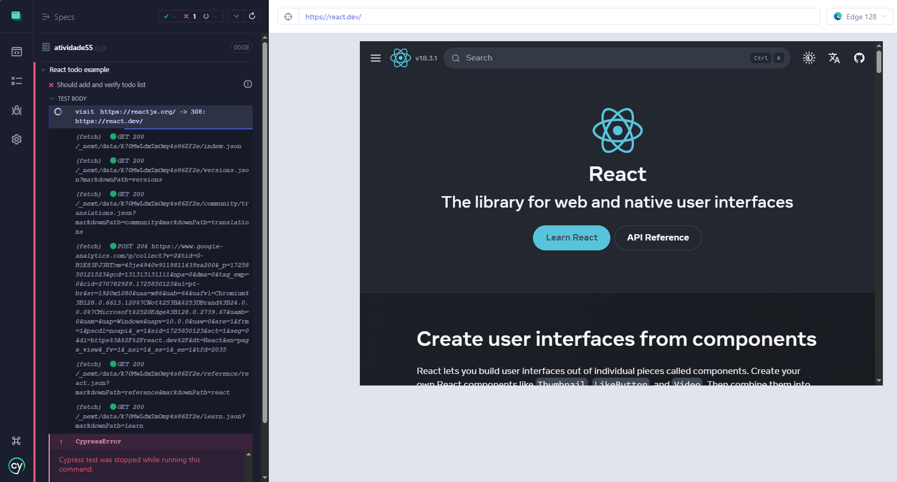
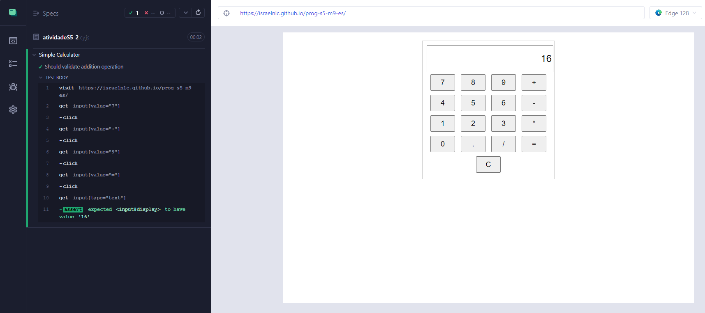

# Teste no React com Cypress

Este repositório foi criado para realizar testes de interfaces Web com o cypress. Para executar, é necessário instalar as dependências:

```cmd
npm install cypress --save-dev
```

E executar o Cypress:

```cmd
npx cypress open
```

# Testes

<u><h3>Site do React</h2></u>
Seguindo o artigo, primeiro fiz o teste do site do React. Acredito que com o passar do tempo, o site em questão passou por alterações, o que causou que o teste resultasse em erro. O código do teste está disponível [aqui](./cypress/e2e/atividadeS5.cy.js)



O erro em questão deixa claro que não foi possível encontrar uma tag com o id "new-todo".

<u><h3>Site da Calculadora</h2></u>

Acredito que também pela data de publicação do artigo, o site referenciado da calculadora não estava mais disponível, portanto subi uma [versão própria](https://israelnlc.github.io/prog-s5-m9-es/). O código do este está disponível [aqui](./cypress/e2e/atividadeS5_2.cy.js).



Achei interessante pois ao seguir os conceitos do TDD, escrevi o teste do artigo, o qual deu erro, então assim, busquei corrigir o erro e construir a página da calculadora, com o intuito que o teste passasse. Após a correção, o teste passou com sucesso.

<hr>

Baseado no artigo: https://www.browserstack.com/guide/how-to-test-react-using-cypress